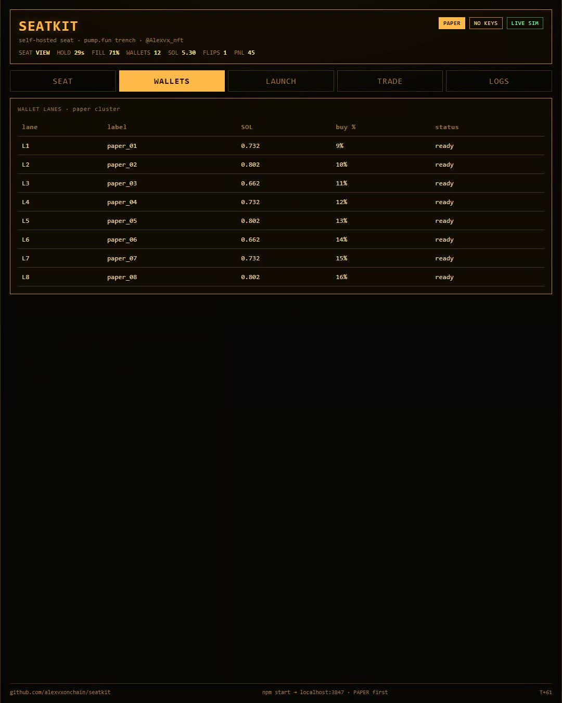

# SEATKIT

Self-hosted operator seat for [pump.fun](https://pump.fun) trench. PAPER by default. No keys in the repo.



**Self-hosted operator seat for the pump.fun trench.**

PAPER by default. No keys in the repo. You run it on your machine.

> SEAT · CLIMB · FALL · LAUNCH · TRADE · LOGS  
> one local desk instead of five browser tabs

Not affiliated with pump.fun. Research + operator tooling by [@Alexvx_nft](https://x.com/Alexvx_nft).

---

## Why SEATKIT

Open Solana trench consoles already exist as self-hosted launch/trade UIs wired around PumpPortal-style routes and local wallet files. Most of them ask for keys on day one.

SEATKIT flips that:

1. boot in **PAPER**
2. learn the seat / climb / fall loop on a live-feeling desk
3. only then wire your own RPC + wallets if you want live sends

Installable. Readable. Yours.

---

## Quick start

```bash
npm install
npm start
```

Open [http://localhost:3847](http://localhost:3847)

Demo auto-tour (for screen recording):

[http://localhost:3847/?demo=1](http://localhost:3847/?demo=1)

---

## Tabs

| Tab | What it does |
|-----|----------------|
| **SEAT** | current king on the simulated pump.fun curve + climbers + fall chart |
| **WALLETS** | paper lane cluster |
| **LAUNCH** | token template surface (paper sim) |
| **TRADE** | batch buy/sell buttons that log paper fills only |
| **LOGS** | SSE mission feed |

---

## Modes

### PAPER (default)
- no private keys loaded
- no chain signatures
- state ticks from the local sim server
- safe to star, fork, and demo

### LIVE (optional, your risk)
Live sends are **not** enabled in this release on purpose.  
If you fork toward live execution, keep keys in ignored local files, use your own RPC, and test tiny size first. Never commit `.env` or `wallets/`.

---

## Stack

- Node 18+
- Express static host + `/api/state` + SSE `/api/logs`
- Zero frontend build step

Inspired by the open self-hosted pump.fun console category (local desk, multi-wallet lanes, launch/trade tabs). SEATKIT UI + paper runtime are original.

---

## Security

- This repo ships **PAPER only**
- Do not paste seed phrases into the UI
- Do not commit secrets
- Not financial advice. Memecoin ops can go to zero.

---

## Links

- X: https://x.com/Alexvx_nft
- pump.fun: https://pump.fun/

---

## License

MIT
